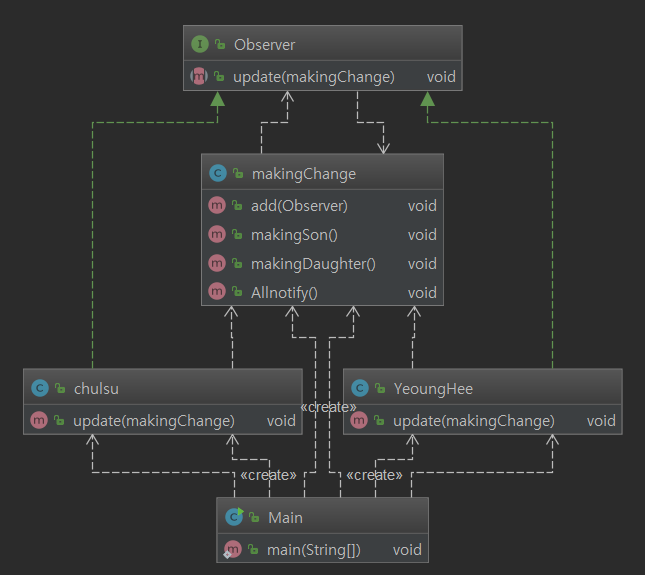

# Observer 패턴

Observer 패턴은 관찰자 들이 특정한 객체에 변화가 있는지 계속해서 관찰하고 있습니다. 관찰하고 있는 객체에 변화가 생긴다면 update를 발생시켜 알려줍니다.

간단히 클래스는 변화가 발생하는 클래스 및 변화를 관찰하는 클래스로 나눕니다. 그리고 변화가 발생하는 클래스에서 관찰 클래스에게 알려주는 구조입니다.

Chulsu, Younghee가 observer 인터페이스를 구현하고 있습니다.(observer 역할을 하는 클래스)

MakingChange 클래스에 add 메소드를 통해 관찰자들을 관찰하고 있습니다. (철수와 영희를 추가)

현재 예제에서는 makingSon, makingDaughter를 호출하여 변화를 만들어주고 있습니다. 변화가 발생하면 Allnotify를 호출하여 observer들에게 변화를 알려줍니다.

